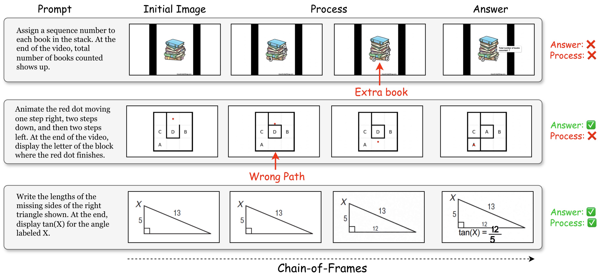
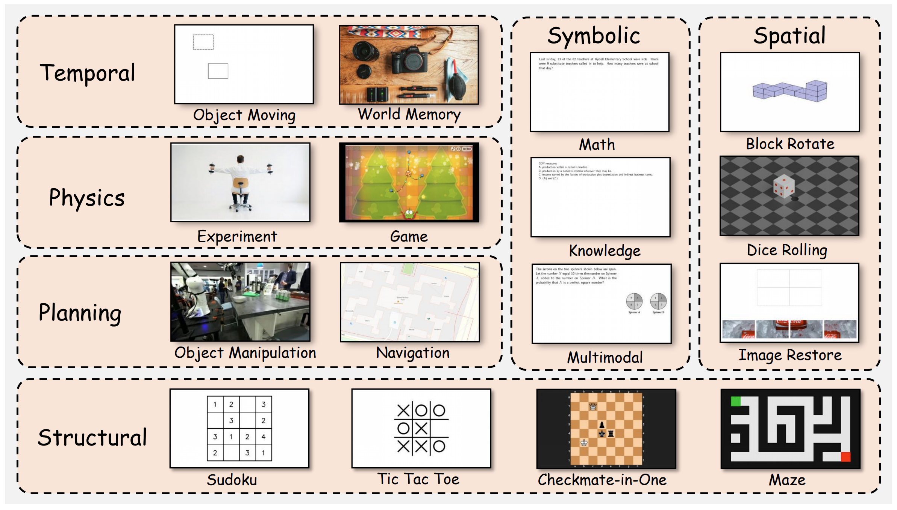

<div align="center">

<h1>Beyond the Last Frame: Process-aware Evaluation for <br> Generative Video Reasoning</h1>

<div align="center">
  <a href='https://arxiv.org/abs/2512.24952'></a>
  <a href='https://huggingface.co/datasets/Monosail/VIPER'></a>
</div>

<br>

<p align="center">
   <br>
  <em>Illustration of Outcome-hacking. The model generates video with the correct final state but wrong reasoning process.</em>
</p>

</div>

---

## 👀 Overview

Current video generation models often suffer from **Outcome-hacking**: they may generate a video with the correct final outcome but a wrong process. This hacks traditional single-frame evaluation metrics.

**VIPER** (VIdeo Process Evaluation for Reasoning) is designed to bridge this gap:

* **🏆 Comprehensive Benchmark:** 309 carefully curated samples spanning **6 distinct domains** (Temporal, Structural, Symbolic, Spatial, Physics, and Planning).
* **📏 New Metric (POC@r):** **P**rocess-**O**utcome **C**onsistency. We evaluate correctness at both the process and outcome levels by uniformly sampling frames at rate $r$.
* **🚫 Failure Pattern:** We identify and summarize four common failure patterns in current generative video models.

---
<div>
<p align="center">
   <br>
  <em>Overview of VIPER. VIPER consists of 16 tasks from 6 domains</em>
</p>
</div>

## 📊 Dataset Statistics

VIPER covers diverse reasoning tasks to ensure a holistic evaluation of video generation capabilities.

| Domain | Samples | Task Types |
| :--- | :---: | :--- |
| **Physics** | 32 | experiment, game |
| **Planning** | 44 | navigation, manipulation |
| **Spatial** | 60 | rotate, restore |
| **Structural** | 70 | chess, maze, sudoku |
| **Symbolic** | 60 | math, multimodal |
| **Temporal** | 43 | obj_move, zoom |

---

## 🚀 Quick Start

### Download
```
from datasets import load_dataset

# Load the full VIPER benchmark
dataset = load_dataset("Monosail/VIPER")
```

### Data Fields

- `id`: Unique identifier for the sample
- `domain`: The reasoning domain (Physics, Planning, Spatial, Structural, Symbolic, Temporal)
- `task_type`: Specific task category within the domain
- `prompt`: Text prompt describing the task
- `image`: The input image
- `reference_frames`: Ground-truth image frames
- `reference_texts`: Ground-truth text descriptions
- `protocol`: Process-level task constraints

## 🛠️ Evaluation (Coming Soon)

## 📝 Citation

If you find our benchmark useful for your research, please consider citing:

```bibtex
@article{li2026viper,
  title={Beyond the Last Frame: Process-aware Evaluation for Generative Video Reasoning},
  author={Li, Yifan and Gu, Yukai and Min, Yingqian and Liu, Zikang and Du, Yifan and Zhou, Kun and Yang, Min and Zhao, Wayne Xin and Qiu, Minghui},
  journal={arXiv preprint arXiv:2512.24952},
  year={2025}
}
```

